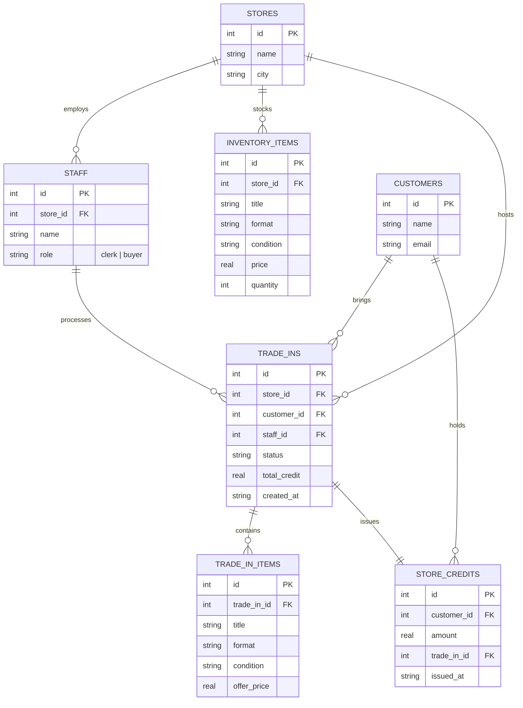

```mermaid
erDiagram
    STORES ||--o{ STAFF : employs
    STORES ||--o{ INVENTORY_ITEMS : stocks
    STORES ||--o{ TRADE_INS : hosts
    CUSTOMERS ||--o{ TRADE_INS : brings
    CUSTOMERS ||--o{ STORE_CREDITS : holds
    STAFF ||--o{ TRADE_INS : processes
    TRADE_INS ||--o{ TRADE_IN_ITEMS : contains
    TRADE_INS ||--|| STORE_CREDITS : issues

    STORES {
        int id PK
        string name
        string city
    }
    STAFF {
        int id PK
        int store_id FK
        string name
        string role "clerk | buyer"
    }
    CUSTOMERS {
        int id PK
        string name
        string email
    }
    INVENTORY_ITEMS {
        int id PK
        int store_id FK
        string title
        string format
        string condition
        real price
        int quantity
    }
    TRADE_INS {
        int id PK
        int store_id FK
        int customer_id FK
        int staff_id FK
        string status
        real total_credit
        string created_at
    }
    TRADE_IN_ITEMS {
        int id PK
        int trade_in_id FK
        string title
        string format
        string condition
        real offer_price
    }
    STORE_CREDITS {
        int id PK
        int customer_id FK
        real amount
        int trade_in_id FK
        string issued_at
    }
```
